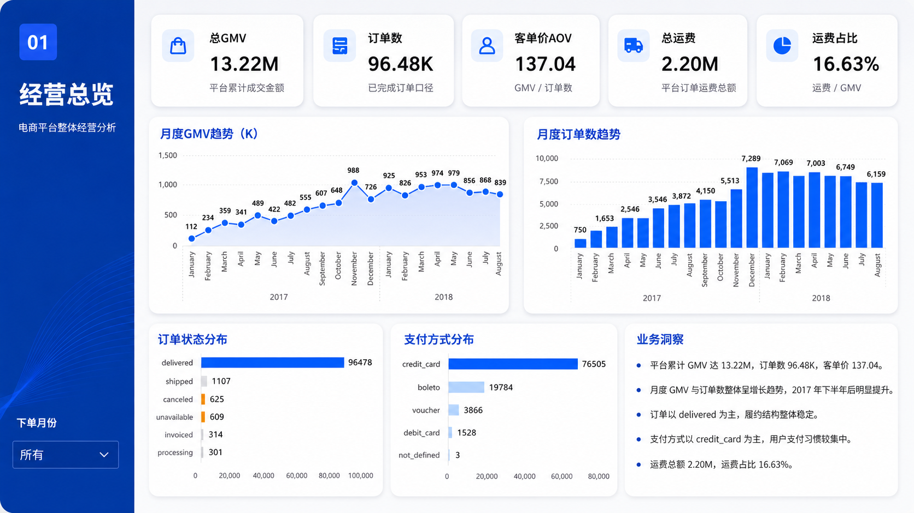
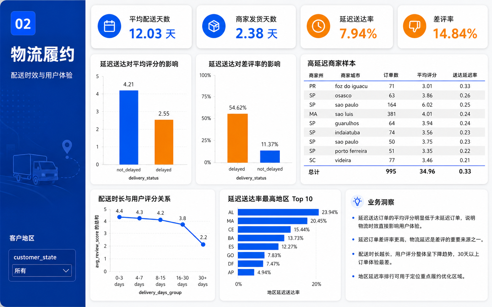
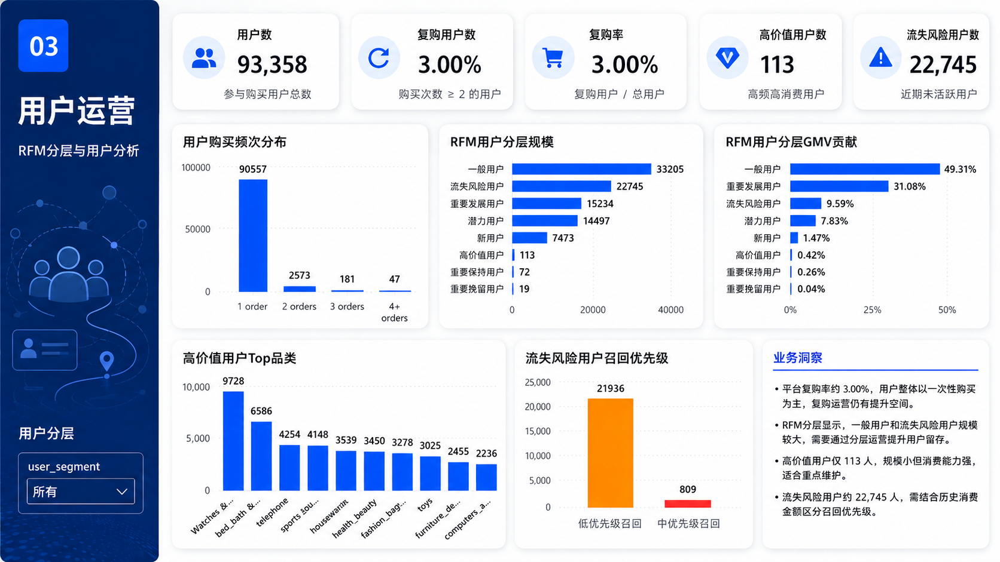

# Olist 电商平台经营分析项目

## 1. 项目简介

本项目基于 Kaggle 平台公开的 **Olist Brazilian E-Commerce** 多表电商数据集，围绕平台经营、物流履约和用户运营三个方向进行分析。

项目使用 **MySQL + Navicat** 完成原始数据导入、多表关联、数据清洗和 ADS 指标汇总，并使用 **Power BI** 搭建三页可视化看板，最终输出电商平台经营诊断和业务优化建议。

本项目重点展示：

* SQL 多表关联与数据建模能力
* ODS-DWD-ADS 分层分析流程
* 电商核心指标体系设计能力
* Power BI 可视化看板搭建能力
* 基于数据结果输出业务洞察的能力

---

## 2. 项目目标

本项目主要围绕以下问题展开：

1. 平台整体经营表现如何？
2. GMV、订单数、AOV、运费占比等核心指标表现如何？
3. 订单状态和支付方式结构是否稳定？
4. 物流履约效率是否影响用户评分和差评率？
5. 哪些地区或商家存在较高物流风险？
6. 平台用户复购情况如何？
7. 不同 RFM 用户分层的用户规模和 GMV 贡献如何？
8. 高价值用户和流失风险用户分别应如何运营？

---

## 3. 数据来源

本项目使用 Kaggle 公开数据集：

**Brazilian E-Commerce Public Dataset by Olist**

数据集地址：

```text
https://www.kaggle.com/datasets/olistbr/brazilian-ecommerce
```

该数据集包含巴西电商平台 Olist 的订单、商品、支付、评价、客户、商家、地理位置等多张业务表，适合用于电商经营分析、物流分析、评价分析和用户运营分析。

由于原始 CSV 文件较大，本仓库不上传完整原始数据，仅保留 SQL 生成后的 ADS 汇总样例表，用于展示指标结果和 Power BI 看板数据结构。

---

## 4. 技术栈

| 类型    | 工具                   |
| ----- | -------------------- |
| 数据库   | MySQL                |
| 数据库管理 | Navicat              |
| 数据处理  | SQL                  |
| 数据建模  | ODS-DWD-ADS          |
| 可视化   | Power BI             |
| 项目管理  | GitHub               |
| 数据源   | Kaggle Olist Dataset |

---

## 5. 项目流程概览

本项目整体流程如下：

```text
原始 CSV 数据
→ MySQL 建表导入
→ ODS 原始数据层
→ DWD 清洗明细层
→ ADS 指标汇总层
→ Power BI 三页可视化看板
→ 业务洞察输出
```

数据分层说明：

| 数据层级      | 说明                               |
| --------- | -------------------------------- |
| ODS 原始层   | 保存从 Kaggle CSV 导入 MySQL 后的原始业务表  |
| DWD 清洗明细层 | 对订单、商品、支付、评价、物流、用户等多表进行清洗和关联     |
| ADS 指标汇总层 | 生成 Power BI 看板直接使用的经营、物流、用户运营指标表 |

完整分析流程见：

```text
docs/analysis_flow.md
```

---

## 6. 原始数据表

原始数据导入 MySQL 后，主要包括以下业务表：

| 表名                   | 含义      |
| -------------------- | ------- |
| customers            | 客户信息表   |
| orders               | 订单主表    |
| order_items          | 订单明细表   |
| order_payments       | 订单支付表   |
| order_reviews        | 订单评价表   |
| products             | 商品信息表   |
| sellers              | 商家信息表   |
| geolocation          | 地理位置表   |
| category_translation | 商品品类翻译表 |

---

## 7. 核心 ADS 表

本项目最终围绕三页 Power BI 看板生成 16 张 ADS 汇总表。

### 7.1 经营总览 ADS 表

| 表名                                | 用途                            |
| --------------------------------- | ----------------------------- |
| ads_business_overview             | 平台核心 KPI：GMV、订单数、AOV、总运费、运费占比 |
| ads_monthly_business_trend_stable | 月度 GMV 趋势、月度订单数趋势             |
| ads_order_status_analysis         | 订单状态分布                        |
| ads_payment_type_analysis         | 支付方式分布                        |

### 7.2 物流履约 ADS 表

| 表名                                | 用途                      |
| --------------------------------- | ----------------------- |
| ads_logistics_overview            | 平均配送天数、商家发货天数、延迟送达率、差评率 |
| ads_delay_review_impact           | 延迟送达与未延迟送达订单的评分、差评率对比   |
| ads_delivery_days_review_analysis | 配送时长分组与用户评分关系           |
| ads_logistics_by_customer_state   | 各地区延迟送达率                |
| ads_seller_logistics_analysis     | 商家物流履约表现与风险识别           |

### 7.3 用户运营 ADS 表

| 表名                                | 用途                 |
| --------------------------------- | ------------------ |
| ads_repurchase_overview           | 用户数、复购用户数、复购率      |
| ads_user_purchase_frequency       | 用户购买频次分布           |
| ads_rfm_user_segment              | RFM 用户分层规模和 GMV 贡献 |
| ads_high_value_user_overview      | 高价值用户概览            |
| ads_high_value_user_category      | 高价值用户 Top 品类       |
| ads_at_risk_user_overview         | 流失风险用户概览           |
| ads_at_risk_user_priority_summary | 流失风险用户召回优先级        |

---

## 8. Power BI 看板展示

本项目最终完成三页 Power BI 看板：

```text
01 经营总览
02 物流履约
03 用户运营
```

---

### 8.1 经营总览

经营总览页面用于观察平台整体交易规模、订单趋势、支付结构和订单状态。

核心内容包括：

* 总 GMV、订单数、客单价 AOV、总运费、运费占比
* 月度 GMV 趋势
* 月度订单数趋势
* 订单状态分布
* 支付方式分布
* 平台经营业务洞察



---

### 8.2 物流履约

物流履约页面用于分析物流时效对用户体验的影响，并识别高延迟地区和高风险商家。

核心内容包括：

* 平均配送天数、商家发货天数、延迟送达率、差评率
* 延迟送达对平均评分的影响
* 延迟送达对差评率的影响
* 配送时长与用户评分关系
* 延迟送达率最高地区
* 高物流风险商家样本



---

### 8.3 用户运营

用户运营页面用于分析用户复购、RFM 用户分层、高价值用户和流失风险用户。

核心内容包括：

* 用户数、复购用户数、复购率、高价值用户数、流失风险用户数
* 用户购买频次分布
* RFM 用户分层规模
* RFM 用户分层 GMV 贡献
* 高价值用户 Top 品类
* 流失风险用户召回优先级



---

## 9. 核心指标口径

| 指标     | 计算口径                                |
| ------ | ----------------------------------- |
| GMV    | 商品销售金额汇总，`SUM(price)`               |
| 订单数    | 去重订单数量，`COUNT(DISTINCT order_id)`   |
| AOV    | GMV / 订单数                           |
| 总运费    | 运费金额汇总，`SUM(freight_value)`         |
| 运费占比   | 总运费 / GMV                           |
| 平均配送天数 | 实际签收时间 - 下单时间                       |
| 商家发货天数 | 实际发货时间 - 订单确认时间                     |
| 延迟送达率  | 延迟送达订单数 / 总订单数                      |
| 差评率    | 评分 1-2 分订单数 / 有评价订单数                |
| 复购用户数  | 购买次数 ≥ 2 的用户数量                      |
| 复购率    | 复购用户数 / 总用户数                        |
| RFM    | Recency、Frequency、Monetary 用户价值分层模型 |

完整指标口径见：

```text
docs/metric_definition.md
```

---

## 10. 核心业务发现

### 10.1 平台整体交易规模稳定增长

平台 GMV 和订单数在 2017 至 2018 年期间整体呈增长趋势，说明平台交易规模持续扩大。

支付方式以 credit_card 为主，说明信用卡支付是平台最核心的支付方式。

订单状态以 delivered 为主，说明大部分订单最终完成交付，但仍存在 canceled、unavailable、shipped 等异常或未完成订单状态，需要持续关注。

---

### 10.2 物流延迟显著影响用户体验

延迟送达订单的平均评分明显低于未延迟送达订单，差评率明显更高。

随着配送天数增加，订单平均评分下降，差评率上升，说明物流履约是影响用户体验的重要因素。

平台应重点关注高延迟地区和高物流风险商家，优化发货效率和配送时效。

---

### 10.3 用户复购率较低，留存仍有提升空间

用户购买频次分布显示，大部分用户只购买 1 次，复购用户占比较低。

这说明平台整体用户以一次性购买为主，后续可以通过优惠券、会员体系、个性化推荐和复购召回等方式提升用户留存。

---

### 10.4 RFM 分层支持精细化运营

RFM 分层结果显示，不同用户群体在用户规模、GMV 贡献、购买频次和消费金额上存在明显差异。

高价值用户数量较少，但消费能力较强，适合重点维护。

流失风险用户规模较大，需要结合召回优先级进行分层运营，避免对所有用户采用同一种运营策略。

---

## 11. 项目文件结构

```text
olist-ecommerce-analysis/
│
├── README.md
├── .gitignore
│
├── sql/
│   ├── 01_create_database_and_tables.sql
│   ├── 02_dwd_cleaning_and_wide_table.sql
│   ├── 03_ads_business_overview.sql
│   ├── 04_ads_logistics_experience.sql
│   └── 05_ads_rfm_user_operation.sql
│
├── dashboard/
│   └── olist_powerbi_dashboard.pbix
│
├── images/
│   ├── 经营总览.png
│   ├── 物流履约.png
│   └── 用户运营.png
│
├── data_sample/
│   ├── ads_business_overview.csv
│   ├── ads_monthly_business_trend_stable.csv
│   ├── ads_order_status_analysis.csv
│   ├── ads_payment_type_analysis.csv
│   ├── ads_logistics_overview.csv
│   ├── ads_delay_review_impact.csv
│   ├── ads_delivery_days_review_analysis.csv
│   ├── ads_logistics_by_customer_state.csv
│   ├── ads_seller_logistics_analysis.csv
│   ├── ads_repurchase_overview.csv
│   ├── ads_user_purchase_frequency.csv
│   ├── ads_rfm_user_segment.csv
│   ├── ads_high_value_user_overview.csv
│   ├── ads_high_value_user_category.csv
│   ├── ads_at_risk_user_overview.csv
│   └── ads_at_risk_user_priority_summary.csv
│
└── docs/
    ├── metric_definition.md
    └── analysis_flow.md
```

---

## 12. SQL 文件说明

| 文件                                 | 说明                   |
| ---------------------------------- | -------------------- |
| 01_create_database_and_tables.sql  | 创建数据库、原始表结构和表名规范化    |
| 02_dwd_cleaning_and_wide_table.sql | 构建 DWD 清洗明细表和用户购买汇总表 |
| 03_ads_business_overview.sql       | 生成经营总览页面所需 ADS 指标表   |
| 04_ads_logistics_experience.sql    | 生成物流履约页面所需 ADS 指标表   |
| 05_ads_rfm_user_operation.sql      | 生成用户运营页面所需 ADS 指标表   |

SQL 执行顺序：

```text
01_create_database_and_tables.sql
→ 02_dwd_cleaning_and_wide_table.sql
→ 03_ads_business_overview.sql
→ 04_ads_logistics_experience.sql
→ 05_ads_rfm_user_operation.sql
```

---

## 13. 项目复现步骤

1. 从 Kaggle 下载 Olist 原始数据集。
2. 在 MySQL 中创建 `olist_ecommerce` 数据库。
3. 使用 Navicat 或 MySQL 导入原始 CSV 数据。
4. 按顺序执行 `sql/` 文件夹中的 SQL 脚本。
5. 生成 DWD 清洗明细表和 ADS 汇总指标表。
6. 将 ADS 表导出为 CSV，或使用 Power BI 直接连接 MySQL。
7. 在 Power BI 中构建经营总览、物流履约、用户运营三页看板。
8. 根据看板结果输出业务洞察。

---

## 14. 相关文档

* [完整分析流程说明](docs/analysis_flow.md)
* [指标口径说明](docs/metric_definition.md)

---

## 15. 项目总结

本项目完成了从原始电商多表数据到 Power BI 经营分析看板的完整数据分析流程。

项目核心价值包括：

1. 使用 MySQL 完成多表关联和指标建模。
2. 构建 ODS-DWD-ADS 分层分析流程。
3. 基于 SQL 生成经营、物流、用户运营三类指标表。
4. 使用 Power BI 搭建三页业务分析看板。
5. 从交易规模、物流体验、用户价值三个角度输出业务洞察。

该项目能够体现电商业务理解、SQL 数据建模能力、指标体系设计能力和 Power BI 可视化表达能力。
